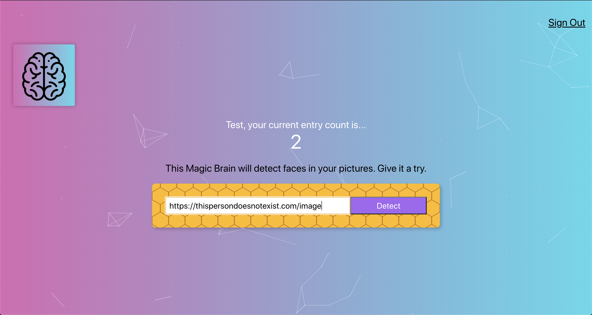
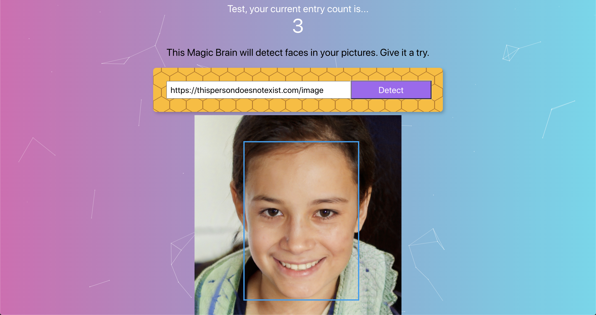

# Smart Brain: Face Detection App

By Roy Fa-Lin Wang

[Link to Smart Brain](https://smart-brain-roy.herokuapp.com/)

[Link to front-end repo](https://github.com/falinwang/react-facerecognitionbrain)

[Link to back-end repo](https://github.com/falinwang/react-facerecognitionbrain-api)

---
## About Smart Brain

Smart brain is a web app that detects the human face present in the image whose URL you submitted.

## Project Description

This project is about using Clarify API to detect the human faces in the image the user uploaded after they registered and save the counts of their uploaded image. 
This project is built with React.js, Node.js, Express.js, as well as a PostgreSQL is in charge of user sign-in/registration as well as keeping track of the number of entries for each user.

## How to Use

This website is now deployed on Heroku: [Smart Brain by Roy](https://smart-brain-roy.herokuapp.com/). (The first loading might require 30-second of wait.)
1. Register a user account with name, email and password

2. Paste an image URL in the box and click Detect Button.

- In case you don't know where to find image URL, you can try: `https://thispersondoesnotexist.com/image`. [This person does not exist](https://thispersondoesnotexist.com/) is created by [Phillip Wang](https://www.producthunt.com/posts/this-person-does-not-exist).

1. Ta-DA! Did you see the face?

4. You can sign out and sign in to earn more entries!